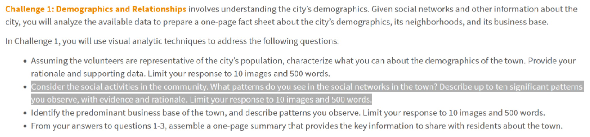

# Overview

In this take-home exercise, we work on bullet points 2 of Challenge 1 of [
**VAST Challenge 2022**](https://vast-challenge.github.io/2022/) to reveal the patterns of community interactions in the city of Engagement, Ohio USA.



# Getting Started

Before we get started, it is important for us to ensure that the required R packages have been installed. If yes, we will load the R packages. If they have yet to be installed, we will install the R packages and load them onto R environment.

The chunk code below will do the trick.

```{r}
packages = c('igraph', 'tidygraph', 
             'ggraph', 'visNetwork', 
             'lubridate', 'clock',
             'tidyverse', 'graphlayouts')
for (p in packages){
  if(!require(p, character.only = T)){
    install.packages(p)
  }
  library(p,character.only = T)
}
```

# Importing Data

The code chunk below imports *Participants.csv* and *SocialNetwork.csv* from the data folder into R by using the [`read_csv()`](https://readr.tidyverse.org/reference/read_delim.html) function of [**readr**](https://readr.tidyverse.org/index.html) and saves them as tibble data frames called *nodes_data* and *edges_data* respectively.

```{r}
nodes_data <- read.csv("data/Participants.csv")
```
```{r, eval = FALSE}
edges_data <- read_csv("data/SocialNetwork.csv")
```
```{r, echo=FALSE}
edges_aggregated <- readRDS(file = "data/edges_aggregated.rds")
```

# Data Preperation

### Create day of week column

The chunk code below uses the [`mutate()`](https://dplyr.tidyverse.org/reference/mutate.html) function from the [**dplyr**] package to add the day of the week of the interaction to the *edges_data* data table. This is computed using the [`wday()`](https://lubridate.tidyverse.org/reference/day.html) function from the [**lubridate**](https://lubridate.tidyverse.org/index.html) package. 

```{r, eval = FALSE}
edges_data <- mutate(edges_data, weekday = wday(timestamp, label = TRUE, abbr = FALSE))
```

### Rename Columns

The [`rename()`](https://dplyr.tidyverse.org/reference/rename.html) function of **dplyr** was also used to rename the *participantIdFrom* and *participantIdTo* columns.

```{r, eval = FALSE}
edges_data <- rename(edges_data,
                     from = participantIdFrom,
                     to = participantIdTo)
```

### Time decay of interaction importance

To evaluate the strength of the relationship between a  source-target pair today (2023-05-25), each interaction will be weighted based on its recency. lets assume that the earliest interactions on 2022-03-01 is **10%** as important today as the latest interactions on 2023-05-25 and that interaction weight decreases exponentially with time. Hence:

number of days from 2022-03-01 to 2023-05-25: $n = 450$

weight decay per day: $\lambda = (0.1)^{1/n} = 0.994896 (6.sf)$

In the chunk code below, [`difftime()`](https://www.rdocumentation.org/packages/base/versions/3.6.2/topics/difftime) is used to count the number of days between each time stamp and 2023-05-25.

```{r, eval = FALSE}
edges_data <- edges_data %>%
  mutate(decay_cycles = as.integer(ceiling(difftime("2023-05-25", timestamp, units = "days")))) %>%
  mutate(decay_weight = 0.994896**(decay_cycles))
```

### Aggregate interactions

In the chunk code below, [`group_by()`](https://dplyr.tidyverse.org/reference/group_by.html), [`summarise()`](https://dplyr.tidyverse.org/reference/summarise.html) and ['ungroup()`](https://dplyr.tidyverse.org/reference/group_by.html) functions from **dplyr** were used to create a column containing the number of interactions between each source-target pair. The aggregated data table was filtered to remove interactions where the source and target were the same person. Additionally, as we only want to study source-target pairs with a strong relationship, only those with weights of **more than 75** will be retained. This number works out to having a constant rate of approximately 3 interactions a week for the period that data was provided. Hence, we will likely be seeing source-target pairs that are close friends, immediate family or colleagues from the same team.

```{r, eval = FALSE}
edges_aggregated <- edges_data %>%
  group_by(from, to) %>%
    summarise(Weight = sum(decay_weight)) %>%
  filter(from!=to) %>%
  filter(Weight > 75) %>%
  ungroup()
```

### Filtering nodes

The chunk code below will remove nodes that do not have significant edge weight with other nodes (atleast 25). [`pull()`](https://dplyr.tidyverse.org/reference/pull.html) function from **dplyr** is used to extract the from and to columns from *edges_aggregated* into lists. [`append`](https://www.rdocumentation.org/packages/base/versions/3.6.2/topics/append) is used to join both list and [`unique`](https://www.rdocumentation.org/packages/base/versions/3.6.2/topics/unique) is used to remove duplicate IDs. Lastly, `filter()` is used again to only retain the necessary nodes.

```{r}
T1 <- pull(edges_aggregated, from)
T2 <- pull(edges_aggregated, to)
nodes_unique <- unique(append(T1, T2))

nodes_data <- filter(nodes_data, participantId %in% nodes_unique)
```

### Creating network graph data frame

In the code chunk below, [graph_from_data_frame()](https://www.rdocumentation.org/packages/influential/versions/2.2.5/topics/graph_from_data_frame) from [**igraph**](https://www.rdocumentation.org/packages/igraph/versions/1.3.1) is used to create an igraph object which can subsequently be used to plot network graphs.

```{r}
network_graph <- graph_from_data_frame(edges_aggregated, 
                                       vertices = nodes_data) %>%
  as_tbl_graph()
```

# Visualising Overall Network

The code chunk below uses [`ggraph()`](https://ggraph.data-imaginist.com/reference/ggraph.html), [`geom-edge_link()`](https://ggraph.data-imaginist.com/reference/geom_edge_link.html) [`geom_node_point()`](https://ggraph.data-imaginist.com/reference/geom_node_point.html) and [`scale_edge_width()`](https://ggraph.data-imaginist.com/reference/scale_edge_width.html) from [**ggraph**](https://ggraph.data-imaginist.com/index.html) package to plot a network graph. The edge widths are dependent on the weight assigned to them. A larger width indicates that the interactions between the source-target pair are more recent/more frequent. [`theme_graph()`](https://ggraph.data-imaginist.com/reference/theme_graph.html) is used to give the graph a white back ground.

```{r}
set.seed(1234)
ggraph(network_graph, layout = "nicely") +
  geom_edge_link(aes(width=Weight), alpha=0.1) +
  scale_edge_width(range = c(0.1, 1)) +
  geom_node_point(size = 1)+
  labs(title = "Overall network graph") +
  theme_graph(background = "white")
```

As can be seen from the graph above, there is 1 large group of connected nodes, 10 pairs of stand alone nodes and 9 small groups containing less than 5 nodes. The large group can be further divided into 3 closely packed sub groups with thicker edges within the sub-groups and thinner edges connecting the sub-groups.

# Visualising Network by Interest Group

In the chunk code below, the colour of each node is used to indicate the interest group that the participant belongs to.

```{R}
ggraph(network_graph, layout = "nicely") +
  geom_edge_link(aes(width=Weight), alpha=0.1) +
  scale_edge_width(range = c(0.1, 1)) +
  labs(title = "Do people interact within their interest groups?") +
  geom_node_point(aes(colour = interestGroup),size = 1)+
  theme_graph(background = "white")
```

In the graph above, there is no clear indication that interest group is an important factor in the edges formed between the nodes. In the next section, we will analyse to see if this weak link between interest group and edges formed is consistent throughout all interest groups.

In the chunk code below, [`facet_nodes()`](https://ggraph.data-imaginist.com/reference/facet_nodes.html) from **ggraph** is used to display the interactions between source-target pairs from the same interest groups.

```{r}
g <- ggraph(network_graph, 
            layout = "nicely") + 
  geom_edge_link(alpha=0.2, width = 0.2) +
  geom_node_point(aes(colour = interestGroup), 
                  size = 0.5)+
  theme_graph(background = "white")

g + facet_nodes(~interestGroup,
                ncol = 5,
                shrink = TRUE)+
  theme(legend.position = 'bottom',
        aspect.ratio=)+
  labs(title = "Which interest groups have more interaction?")
```

The graph graphs above show more edges between nodes of interest groups A, F, G, H and J compared to the other interest groups.

# Visualising Network by Joviality

In the chunk code below, the colour of each node is used to indicate the joviality of each participant.

```{r}
set.seed(1234)
ggraph(network_graph, layout = "nicely") +
  geom_edge_link(aes(width=Weight), alpha=0.1) +
  scale_edge_width(range = c(0.1, 1)) +
  geom_node_point(aes(colour = joviality),size = 1)+
  labs(title = "Do Jovial people have more interactions?")+
  theme_graph(background = "white")
```

If we observe the 3 subgroups in the main group, we can see that the nodes in the centre of each subgroup are higher in joviality than those in the periphery. In the layout "nicely", nodes with more edges are placed in the centre of groups. This shows that people with higher joviality tend to make strong relationships with more people.

#creating interactive graph

In this section, [**visNetwork**](http://datastorm-open.github.io/visNetwork/) package will be used to create an interactive graph.

### Preparing Data

In the chunk code below, a new data table *nodes_data_vn* is created from *nodes_data* but with the participantId and interestGroup columns renamed as id and group respectively to fit the naming convention of **visNetwork**.

```{r}
nodes_data_vn <- nodes_data %>%
  rename(id = participantId) %>%
  rename(group = interestGroup)
```

In the chunk code below, the graph is created using [`visNetwork()`](http://datastorm-open.github.io/visNetwork/), [`visIgraphLayout()`](http://datastorm-open.github.io/visNetwork/igraph.html), [`visOptions()`](http://datastorm-open.github.io/visNetwork/options.html), [`visLegend()`](http://datastorm-open.github.io/visNetwork/legend.html) and `visLayout()`

```{r}
visNetwork(nodes_data_vn,
           edges_aggregated) %>%
  visIgraphLayout(layout = "layout_with_fr") %>%
  visOptions(highlightNearest = TRUE,
             nodesIdSelection = TRUE,
             selectedBy = "group") %>%
  visLegend() %>%
  visLayout(randomSeed = 1234)
```

```{r setup, include=FALSE}
knitr::opts_chunk$set(echo = TRUE, eval = TRUE, message = FALSE, warning = FALSE)
```