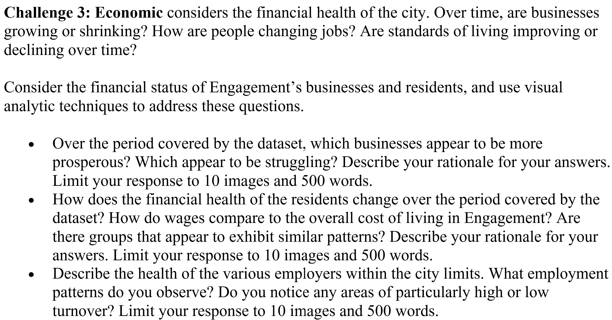

# Overview

In this take-home exercise, we work on Challenge 3 of [
**VAST Challenge 2022**](https://vast-challenge.github.io/2022/), where we are required to reveal the economic of the city of Engagement, Ohio USA by using appropriate static and interactive statistical graphics methods



We are to select one out of the three questions provided above.

For my analysis, I will select question 1 and the analysis will be scoped to pubs in the city of Engagement.

# Getting Started

Before we get started, it is important for us to ensure that the required R packages have been installed. If yes, we will load the R packages. If they have yet to be installed, we will install the R packages and load them onto R environment.

The chunk code below will do the trick.

```{r}
packages = c('ggiraph', 'plotly', 
             'DT', 'patchwork',
             'gganimate', 'tidyverse',
             'readxl', 'gifski', 'gapminder',
             'treemap', 'treemapify',
             'rPackedBar', 'zoo', 'lubridate', 'remotes')
for (p in packages){
  if(!require(p, character.only = T)){
    install.packages(p)
  }
  library(p,character.only = T)
}
```

# Importing Data

The code chunk below imports *Pubs.csv* and *TravelJournal.csv* from the data folder into R by using the [`read_csv()`](https://readr.tidyverse.org/reference/read_delim.html) function of [**readr**](https://readr.tidyverse.org/index.html) and saves them as a tibble data frame called *pubs* and *travel_journal*.

```{r, eval=FALSE}
pubs <- read_csv("data/Pubs.csv")

travel_journal <- read_csv("data/TravelJournal.csv")
```

```{r, echo=FALSE}
cust_rev <- read_csv("data/cust_rev.csv")%>%
  mutate(customers=as.integer(customers), pubId=as.character(pubId))

occupancy_DT <- read_csv("data/occupancy_DT.csv")%>%
  mutate(pubId=as.character(pubId))
```

# Analysis of Pub Revenue

## Data Preperation

The following code chunk was used to create a data table named *cust_rev* which aggregates the revenue, number of customers and the average amount spent by customers for each month.

```{r, eval=FALSE}
cust_rev <- travel_journal%>%
  filter (travelEndLocationId %in% pull(pubs, pubId))%>%
  filter (purpose %in% c("Recreation (Social Gathering)","Eating"))%>%
  mutate(spent = startingBalance - endingBalance,
         month = month(checkInTime),
         year = year(checkInTime),
         travelEndLocationId=as.character(travelEndLocationId))%>%
  group_by(travelEndLocationId, month, year)%>%
  summarize(customers = n(), revenue = sum(spent))%>%
  mutate(timestep = if_else(year==2023, month+10,month-2),
         revenuePerCustomer = revenue/customers)%>%
  rename(pubId = travelEndLocationId)%>%
  ungroup()

glimpse(cust_rev)
```

```{r, echo=FALSE}
glimpse(cust_rev)
```

## Revenue per Customer vs Number of customers

In the following chunk code, [`transition_time()`](https://gganimate.com/reference/transition_time.html) of [*gganimate*](https://gganimate.com/index.html) was used to create transitions of customer numbers and revenue through distinct states in time.

```{r}
lst=c('Mar 22', 'Apr 22', 'May 22', 'Jun 22', 'Jul 22', 'Aug 22', 'Sep 22', 'Oct 22', 'Nov 22', 'Dec 22', 'Jan 23', 'Feb 23', 'Mar 23', 'Apr 23', 'May 23')

month_year <- function(TS){
  MY <- lst[TS]
  return(MY)
}

ggplot(cust_rev, aes(x = customers, y = revenuePerCustomer,
                     size = revenue,
                     colour = pubId)) +
  geom_point(alpha = 0.7, 
             show.legend = TRUE) +
  scale_size(range = c(2, 12))+
  scale_colour_brewer(palette = "Set3")+
  transition_states(timestep, transition_length = 3, state_length = 1) +
  labs(x = 'Number of customers', 
       y = 'Revenue per Customer') +  
  ease_aes('linear')+
  ggtitle("Customer Numbers and Revenue", 
          subtitle = "month: {month_year(as.character(closest_state))}")
```

The animation shows that the number of customers declined rapidly for all pubs after March 2022. The top two pubs for revenue are 1342 and 444. They have the highest revenue as they have a larger number of customers than the rest. The bottom three pubs for revenue are 442, 1799 and 443 which have low number of customers and low revenue per customer.

# Analysis of Pub Occupancy Rate

To generate the occupancy for the pubs, the [*patientcounter*](https://github.com/johnmackintosh/patientcounter) package is required. The following chunk code will install the package and load it onto R environment.

```{r}
remotes::install_github("johnmackintosh/patientcounter")
library(patientcounter)
```

## Data Preperation

The following code chunk was used to create a data table named *occupancy_DT* which shows the average occupancy and occupancy rate for Fridays and Saturdays in the first 4 weeks and last 4 weeks of the provided period. The occupancy and occupancy rate is generated for each hour in the day.

```{r, eval=FALSE}
occ1 <- travel_journal%>%
  filter (travelEndLocationId %in% pull(pubs, pubId))%>%
  filter (purpose %in% c("Recreation (Social Gathering)","Eating"))%>%
  filter (checkInTime >= "2023-04-24 00:00:00")%>%
  mutate(dayOfWeek = wday(checkInTime, label = TRUE))%>%
  arrange(checkInTime)%>%
  filter (dayOfWeek %in% c("Fri","Sat"))
occ1 <- mutate(occ1, identifier = seq.int(nrow(occ1)))

occ2 <- travel_journal%>%
  filter (travelEndLocationId %in% pull(pubs, pubId))%>%
  filter (purpose %in% c("Recreation (Social Gathering)","Eating"))%>%
  filter (checkInTime <= "2022-03-31 00:00:00")%>%
  mutate(dayOfWeek = wday(checkInTime, label = TRUE))%>%
  arrange(checkInTime)%>%
  filter (dayOfWeek %in% c("Fri","Sat"))
occ2 <- mutate(occ2, identifier = seq.int(nrow(occ2)))

occupancy_DT <- tibble(
  base_hour = numeric(),
  pubId = character(),
  occupancy = numeric(),
  occupancy_rate = numeric(),
  period = character()
)

for (i in seq(1, as.numeric(count(pubs)))){
  occtemp1 <- interval_census(filter(occ1,travelEndLocationId == pull(pubs, pubId)[i]),
                                identifier =  "identifier",
                                admit = "checkInTime",
                                discharge  = "checkOutTime", 
                                time_unit = '1 hour',
                                time_adjust_period = 'end_min',
                                time_adjust_value = 59,                
                                results = 'total',
                                uniques = FALSE)%>%
                select(base_hour, N)%>%
                group_by(base_hour)%>%
                summarize(occupancy = sum(N)/8,
                        occupancy_rate = occupancy/pull(pubs, maxOccupancy)[i])%>%
                right_join(data.frame(base_hour = 0:23), by = "base_hour")%>%
                mutate(pubId=as.character(pull(pubs, pubId)[i]), .after = base_hour, period = "last4")%>%
                replace_na(list(occupancy = 0, occupancy_rate = 0))
  occupancy_DT <- bind_rows(occupancy_DT, occtemp1)
  }

  for (i in seq(1, as.numeric(count(pubs)))) {
  occtemp2 <- interval_census(filter(occ2,travelEndLocationId == pull(pubs, pubId)[i]),
                                identifier =  "identifier",
                                admit = "checkInTime",
                                discharge  = "checkOutTime", 
                                time_unit = '1 hour',
                                time_adjust_period = 'end_min',
                                time_adjust_value = 59,                
                                results = 'total',
                                uniques = FALSE)%>%
                select(base_hour, N)%>%
                group_by(base_hour)%>%
                summarize(occupancy = sum(N)/8,
                        occupancy_rate = occupancy/pull(pubs, maxOccupancy)[i])%>%
                right_join(data.frame(base_hour = 0:23), by = "base_hour")%>%
                mutate(pubId=as.character(pull(pubs, pubId)[i]), .after = base_hour, period = "first4")%>%
                replace_na(list(occupancy = 0, occupancy_rate = 0))
  occupancy_DT <- bind_rows(occupancy_DT, occtemp2)
  }

glimpse(occupancy_DT)
```

```{r, echo=FALSE}
glimpse(occupancy_DT)
```

## Occupancy Rate for First vs Last 4 Weeks of Provided Period

A line graph was created showing the hourly occupancy rate over a day for each pub and for both time periods. The [`girafe()`](https://davidgohel.github.io/ggiraph/reference/girafe.html) function of the [*ggiraph*](https://davidgohel.github.io/ggiraph/index.html) was used to create an interactive svg object. Elements associated with a data_id (i.e first/last 4 weeks) will be highlighted upon mouse over.

```{r}
p <- ggplot(data=occupancy_DT,
            aes(x = base_hour, y=occupancy_rate)) +
  geom_line_interactive(              
    aes(color = pubId, data_id = pubId, linetype = period)) +  
  coord_cartesian(xlim=c(0,23), ylim=c(0.0,1.0))+
  scale_colour_brewer(palette = "Set3")+
  labs(title = "Occupancy Rate for Fridays and Saturdays",
       x = 'Hour', 
       y = 'Average Occupancy Rate')
girafe(ggobj = p,
       options = list(
         width_svg = 6,
         height_svg = 6,
         opts_hover(css = "opacity:1;"),
         opts_hover_inv(css = "opacity:0.1;")
         )
       )
```

As expected, we see a decline in occupancy rates for all the pubs from the first to the last 4 weeks of the provided period. The worst hit pubs are pubs 444, 892 and 893 which have occupancy rates below 12.5% in the most recent 4 weeks.