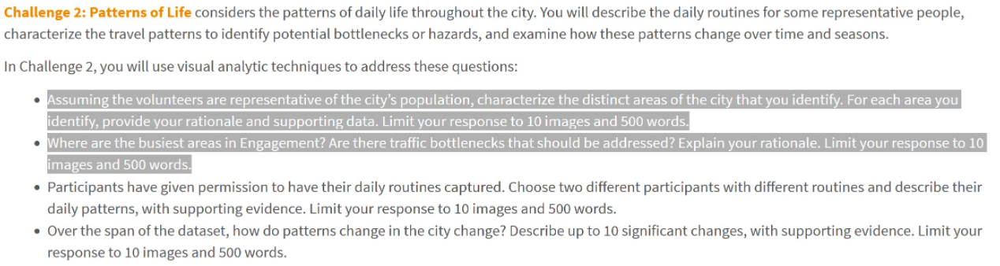

```{r setup, include=FALSE}
knitr::opts_chunk$set(echo = TRUE, eval = TRUE, message = FALSE, warning = FALSE)
```

# Overview

In this take-home exercise, we work on bullet points 1 and 2 of Challenge 2 of [
**VAST Challenge 2022**](https://vast-challenge.github.io/2022/) to reveal the social areas and traffic bottlenecks of the city of Engagement, Ohio USA.



# Getting Started

Before we get started, it is important for us to ensure that the required R packages have been installed. If yes, we will load the R packages. If they have yet to be installed, we will install the R packages and load them onto R environment.

The chunk code below will do the trick.

```{r}
packages = c('tidyverse', 'knitr', 'sf', 'tmap', 'lubridate', 'clock', 'sftime',
             'rmarkdown', 'dplyr')
for (p in packages){
  if(!require(p, character.only = T)){
    install.packages(p)
  }
  library(p,character.only = T)
}
```

# Part 1: Indentifying Different Areas in the City

## Importing Data

In the code chunk below, [`read_sf()`](https://r-spatial.github.io/sf/reference/st_read.html) of [*sf*](https://r-spatial.github.io/sf/index.html) package is used to parse School.csv Pubs.csv, Apartments.csv, Buildings.csv, Employer.csv, and Restaurants.csv into R as sf data.frames.

```{r}
schools <- read_sf("data/wkt/Schools.csv", 
                   options = "GEOM_POSSIBLE_NAMES=location")
pubs <- read_sf("data/wkt/Pubs.csv", 
                   options = "GEOM_POSSIBLE_NAMES=location")
apartments <- read_sf("data/wkt/Apartments.csv")
buildings <- read_sf("data/wkt/Buildings.csv", 
                   options = "GEOM_POSSIBLE_NAMES=location")
employers <- read_sf("data/wkt/Employers.csv", 
                   options = "GEOM_POSSIBLE_NAMES=location")
restaurants <- read_sf("data/wkt/Restaurants.csv", 
                   options = "GEOM_POSSIBLE_NAMES=location")
```

## Data Preperation
In the chunk code below, we will extract combine the pubs and restaurant data tables using [`bind_rows()`](https://dplyr.tidyverse.org/reference/bind.html) of [*dplyr*](https://dplyr.tidyverse.org/index.html) package. In addition, we will create 2 new data tables using [`filter()`](https://dplyr.tidyverse.org/reference/filter.html) which is also from the *dplyr* package; One containing only commercial and school (school_commercial) buildings and the other only containing residential (residental) buildings. Lastly, [`left_join`](https://dplyr.tidyverse.org/reference/mutate-joins.html) is used to add the average rental cost to the residental data table.

```{r}
pub_res <- bind_rows(select(pubs %>% mutate(type = "pubs"),
                        c(location, type)), 
                 select(restaurants %>% mutate(type = "restaurants"),
                        c(location, type)))
school_commercial <- filter(buildings, buildingType %in% c("School","Commercial"))

avg_rental <- mutate(apartments, rentalCost = as.numeric(rentalCost)) %>%
  group_by(buildingId) %>%
  summarize(rental = mean(rentalCost))
residental <- filter(buildings, buildingType == "Residental") %>%
  left_join(avg_rental, by = "buildingId")
```

## Visualising Layout of Buildings in City
In this section, we will visualise the layout of buildings in the city of Engagement.
The code chunk below plots the building polygon features by using [`tm_polygon()`](https://rdrr.io/cran/tmap/man/tm_polygons.html) from [*tmap*](https://rdrr.io/cran/tmap/). [`tm_layout()`](https://www.rdocumentation.org/packages/tmap/versions/3.3-3/topics/tm_layout) is used to add the plot title while [`tm_compass`](https://www.rdocumentation.org/packages/tmap/versions/3.3-3/topics/tm_compass) is used to add a compass.

```{r}
tmap_mode("plot")
tm_shape(buildings)+
  tm_polygons(col = "buildingType",
              border.col = "black",
              border.lwd = 1,
              palette = "Accent")+
tm_shape(pub_res) +
  tm_symbols(col = "type",
             size = 0.15,
             palette = "Set1",
             border.col = "black")+  
tm_layout(title= 'City Layout', 
          title.position = c('right', 'top'),
          legend.title.color = "white") +
tm_compass(type = "4star",
           size = 3)

```

From the plot above, we can see that the city is made up of several commercial hubs surrounded by residential buildings. The 3 commercial hubs are in the top left, center right and bottom right of the map. The pubs and restaurants are found closer to commercial buildings. There are a total of 4 schools spread out across the city.  

## Visualising Cost of Rent
In this section, we will visualise the cost of residential rental throughout the city to determine which areas are more expensive to live in.

```{r}
tmap_mode("plot")
tm_shape(residental)+
tm_polygons(col = "rental",
           border.col = "black",
           border.lwd = 1,
           palette = "Reds",
           textNA = "school/commercial/no rental data",)+
tm_shape(school_commercial)+
tm_polygons(col = "grey",
           border.col = "black",
           border.lwd = 1)+
tm_layout(title= 'Rental Prices', 
          title.position = c('right', 'top')) +
tm_compass(type = "4star",
           size = 3)
```

As can been seen from the plot above, apartments with high rental are mostly found within the 3 commercial hubs.

# Part 2: Finding Traffic Bottle Necks

In this section, we will be using a square binning map that displays the roads that participants frequently travel on.

## Importing Data

In the code chunk below, [`read_sf()`](https://r-spatial.github.io/sf/reference/st_read.html) of [*sf*](https://r-spatial.github.io/sf/index.html) package is used to parse ParticipantStatusLogs1.csv into R as sf data.frames.

```{r, eval = FALSE}
logs <- read_sf("data/wkt/ParticipantStatusLogs1.csv", 
                options = "GEOM_POSSIBLE_NAMES=currentLocation")
```

## Data Preperation

In the chunk code below, we will convert timestamp field from character data type to date-time data type by using [`date_time_parse()`](https://clock.r-lib.org/reference/date-time-parse.html) of [*clock*](https://clock.r-lib.org/index.html) package.
We will derive a day field by using [`get_day()`](https://clock.r-lib.org/reference/clock-getters.html) of clock package.
Lastly, we will extract records where by currentMode field is equal to Transport class by using `filter()`.

```{r, eval = FALSE}
logs_selected <- logs %>%
  mutate(Timestamp = date_time_parse(timestamp,
                zone = "",
                format = "%Y-%m-%dT%H:%M:%S")) %>%
  mutate(day = get_day(Timestamp)) %>%
  filter(currentMode == "Transport")
```

```{r, echo = FALSE}
logs_selected <- readRDS("data/rds/logs_selected.rds")
```

## Binning Current Location into Squares

In the code chunk below, [`st_make_grid()`](https://r-spatial.github.io/sf/reference/st_make_grid.html) of [*sf*](https://r-spatial.github.io/sf/index.html) package is used to create squares. Next, [`st_join()`](https://r-spatial.github.io/sf/reference/st_join.html) is used to perform point in squares overlay while [`count()`](https://dplyr.tidyverse.org/reference/count.html) of *dplyr* is used to count the number of points falling withing each square. Lastly, `left_join()` is used to perform a left-join by using sqr as the target table and points_in_sqr as the join table. The join ID is sqr_id.

```{r}
sqr <- st_make_grid(buildings, 
                    n = c(200, 200)) %>%
  st_sf() %>%
  rowid_to_column('sqr_id')

points_in_sqr <- st_join(logs_selected, 
                        sqr, 
                        join=st_within) %>%
  st_set_geometry(NULL) %>%
  count(name='pointCount', sqr_id)

sqr_combined <- sqr %>%
  left_join(points_in_sqr, 
            by = 'sqr_id') %>%
  replace(is.na(.), 0)
```

## Visualising Road Traffic
In the code chunk below, tmap package is used to create the square binning map.

```{r}
tm_shape(sqr_combined %>%
           filter(pointCount > 0))+
  tm_fill("pointCount",
          n = 10,
          style = "quantile",
          palette = "Reds") +
  tm_borders(alpha = 0) +
tm_layout(title= 'Traffic Congestion', 
          title.position = c('right', 'top')) +
tm_compass(type = "4star",
           size = 3)

```

As can be seen from the plot above, the roads with the most vehicles are those connecting the commercial centers in the top left, centre right and bottom right.